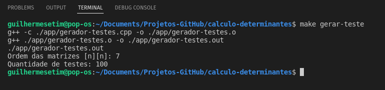

# Análise de métodos de cálculo de determinantes

link da análise de dados: https://github.com/guilhermesetim/tempo-execucao-determinantes/blob/main/analise-dados/analise-dados-determinantes.ipynb

## Sobre o projeto

O projeto tem o propósito de analisar, de forma computacional, a complexidade de tempo de algoritmos de diferentes métodos de calculo de determinates, de ordem 4 em diante. Os métodos selecionados para implementação foram:

- Teorema de LaPlace;
- Regra de Chió;
- Eliminação de Gauss;

**Observação:** Para os métodos Teorema de LaPlace e a Regra de Chío, foram aplicadas a Regra de Sarrus para calcular a determinante de matrizes 3x3, quando havia necessidade de solucionar matrizes de ordem 3.

## Metodologia do teste
O projeto limitou-se a analisar a apartir matrizes de ordem 4 a 8, coletando os valores dessas matrizes por meio de um arquivo .csv. E cada método realizou o calculo de determinante mil vezes, e o tempo de cada solução foi registrado em um arquivo .csv para uma análise posterior das informações.

O tempo foi coletado por meio da biblioteca de tempo *Chrono*, com a escala de tempo definido em nanosegundos. O *Chrono* apresenta-se no *sub-namespace: std::chrono*.

Cada método foi implementado na linguagem de programação C++, por meio do paradigma de Programação Orientada ao Objeto.

## Paradigma
Programação Orientada ao Objeto

## Tecnologias

### Algoritmos
- C++;

### Análise de dados
- Python 3;
- Jupyter Notebook

#### Bibliotecas
- Pandas;
- MatPlotLib;
- Numpy;

## Como executar o projeto do Algoritmo C++
Requisitos:

- Compilador g++;
- Makefile;
- Python;
- Jupyter Notebook;
- Pandas;
- Numpy;
- MatPlotLib;

Realizar o clone do projeto no GitHub:
`git clone 'https://github.com/guilhermesetim/tempo-execucao-determinantes.git' `

Navegar até o diretório do projeto:
`cd tempo-execucao-determinantes`

Compilar e linkar o projeto:
`make`

Executar o projeto:
`make run`

### Arquivos que serão testados
Encontram-se em: `./csv/`

**Nome dos arquivos:** "matriz" + ordem da matriz + ".csv"

### Resultados dos teste
Encontram-se em `./datasets/`

**Nome dos arquivos:** "Resultado" + ordem da matriz + ".csv"

### Recursos a serem implementados
- [x] Gerar matrizes para testes automaticamente;
- [ ] Validar as matrizes geradas;

O recurso de gerador de matrizes pode ser executado com o comando `make gerar-teste`, o código pode ser encontrado em `./app/gerador-testes.cpp`. Será solicitado no terminal a ordem das matrizes, seguindo da quantidade que será gerada.

As matrizes geradas automaticamente podem ser encontradas em `./csv/M` + ordem da matriz + `/`.

## Análise de dados
A análise de dados realizada no jupyter notebook, em um *virtual environment* de python3, acompanhado dos pacotes Pandas, MatPlotLib e Numpy.

O link para acessar a análise encontra-se em: https://github.com/guilhermesetim/tempo-execucao-determinantes/blob/main/analise-dados/analise-dados-determinantes.ipynb

Para executar em seu computador, realize os seguintes passos:

Navegue até ao diretorio do projeto: `cd tempo-execucao-determinantes/analise-dados/`

Ative o *virtual environment*: `source bin/activate`

Ative Jupyter Notebook: `jupyter notebook`

Acesse o arquivo: `analise-dados-determinantes.ipynb`

# Autor

Guilherme Setim